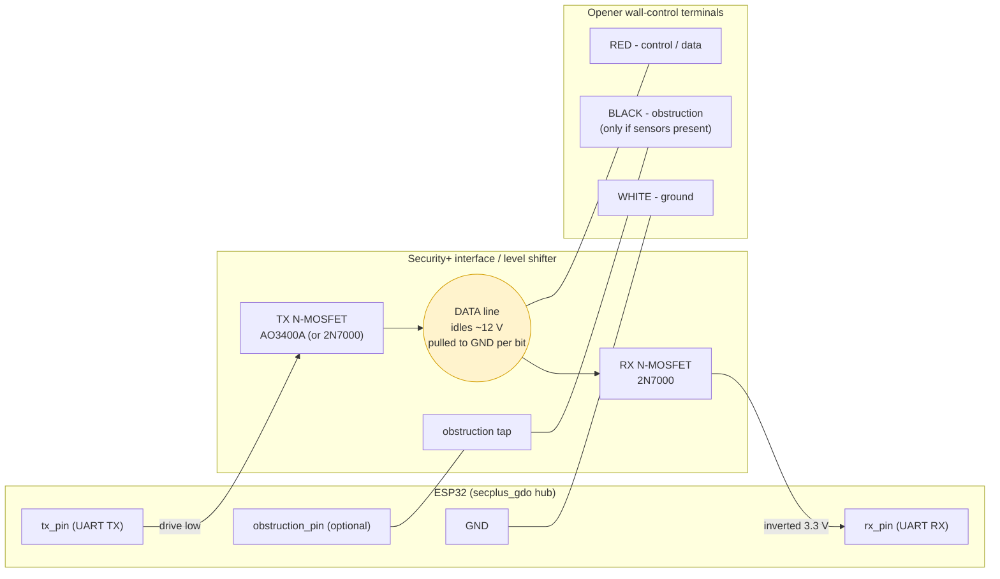

<!--
SPDX-License-Identifier: GPL-3.0-or-later
Copyright (C) 2026 Jared Bunting
-->

# Wiring the ESP32 to a Security+ opener

> [!WARNING]
> The ESP32 **cannot** connect directly to the opener's wall-control bus — that
> bus idles at ~12 V and is not 3.3 V logic. You need the level-shifting front
> end shown below. Wiring it wrong can damage the opener or the ESP32. Unless
> you're comfortable building this circuit, use a ready-made interface board
> (e.g. [ratgdo](https://paulwieland.github.io/ratgdo/) /
> [ratgdo32](https://ratcloud.llc/products/ratgdo32), or a Konnected blaQ) — this
> component drives the same hardware. The circuit below is the established
> open-hardware ratgdo design; the authoritative schematic with exact values is
> [Kaldek/rat-ratgdo](https://github.com/Kaldek/rat-ratgdo).

## How the bus works

Chamberlain/LiftMaster Security+ uses a **two-wire** connection to the wall
control: a ground and a single combined **12 V power + serial data** line. The
data line idles at ~12 V and is pulled to GND for each data bit, so it's a
**half-duplex, single-wire** serial bus — the same wire both transmits and
receives.

The interface uses **N-channel MOSFETs** (common-source) to translate between
that 12 V line and the ESP32's 3.3 V UART, and to ensure the ESP never drives
the line while it's already being pulled low (collision avoidance). Those
common-source stages **invert** the logic, which is why this component must run
the UART inverted — set `invert_uart: true` (see config mapping below).

## Connection topology



Resistors: the front end uses roughly **3× 10 kΩ** (MOSFET gate / pull
resistors); see the schematic for the exact placement.

## Terminal wiring

| Interface terminal | Opener terminal (North America) | Opener terminal (Europe / "rest of world") |
|---|---|---|
| Red (control/data) | Red **+** wall-control terminal | **eSerial** terminal — the green **#0**, *not* the red #1 |
| White (ground) | White **−** wall-control terminal | Ground |
| Black (obstruction) | Obstruction-sensor wire — **only if** discrete sensors are present | Leave disconnected unless sensors are installed |

Security+ 1.0 and 2.0 use the same control/ground terminals; the driver
auto-detects the protocol. On Security+ 2.0 the opener also reports obstruction
in its status frames, so the black wire is usually unnecessary (see
`obstruction_from_status` below).

## Power

The wall-control line is 12 V power + data; you can't run the ESP32 from a GPIO.
Either power the ESP32 separately (USB), or step the 12 V line down with a buck
converter to 5 V/3.3 V (ready-made ratgdo boards include this). Share a common
ground (opener WHITE ↔ ESP32 GND).

## How this maps to the component config

```yaml
secplus_gdo:
  - id: gdo
    tx_pin: 17            # ESP32 GPIO -> TX MOSFET gate
    rx_pin: 16            # ESP32 GPIO <- RX MOSFET
    invert_uart: true     # required: the MOSFET stages invert the logic
    obstruction_from_status: true   # Sec+ 2.0: derive obstruction from status
    # obstruction_pin: 4  # only if wiring the discrete obstruction (BLACK) input
```

- `tx_pin` / `rx_pin` — the two ESP32 GPIOs at the interface; both ultimately
  reach the single DATA line.
- `invert_uart: true` — matches the inverting MOSFET front end. Leave it off
  only if your interface does **not** invert.
- `obstruction_from_status: true` (default) — use the opener's status frames for
  obstruction (no BLACK wire needed on Sec+ 2.0).
- `obstruction_pin` — set only if you wire the discrete obstruction input
  (BLACK), then set `obstruction_from_status: false`.

## Sources

- ratgdo wiring guide — <https://paulwieland.github.io/ratgdo/03_wiring.html>
- rat-ratgdo open-hardware schematics — <https://github.com/Kaldek/rat-ratgdo>
- ESPHome ratgdo (same hardware family) — <https://ratgdo.github.io/esphome-ratgdo/>
